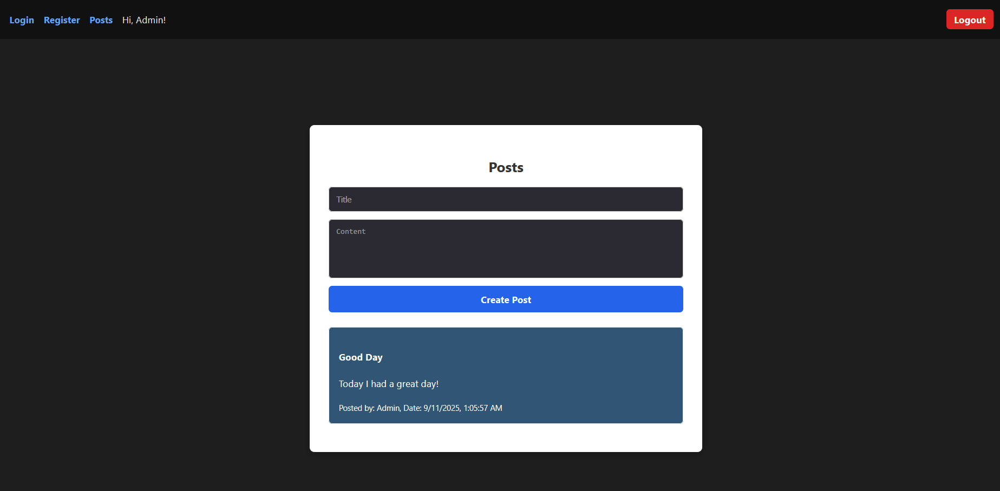

# Lumen-React Project with Node.js Caching Layer and RBAC


A full-stack web application built with React, Lumen (PHP), and Node.js as a caching/API layer. It features user authentication, post management, Redis caching, RBAC (roles & permissions), REST API, and unit testing.

---


## Table of Contents

- [Features](#features)  
- [Tech Stack](#tech-stack)  
- [Getting Started](#getting-started)  
  - [Prerequisites](#prerequisites)  
  - [Setup Lumen Backend](#setup-lumen-backend)  
  - [Setup Node.js Caching Layer](#setup-nodejs-caching-layer)  
  - [Setup React Frontend](#setup-react-frontend)  
- [RBAC Management](#rbac-management)  
- [API Documentation (Postman Collections)](#api-documentation-postman-collections)  
- [Running Tests](#running-tests)  
- [Docker Setup](#docker-setup)  
- [Notes](#notes)  
- [License](#license)  

---

## Features

- **User Authentication**: Login and registration with JWT tokens.  
- **Role-Based Access Control (RBAC)**: Users can have roles (admin, editor, user) with specific permissions. Middleware enforces access for protected routes.  
- **Post Management**: Create, view, and delete posts based on permissions.  
- **Optimistic UI Updates**: Newly created posts appear instantly without waiting for server response.  
- **Caching**: Posts are cached in **Redis** via Node.js for faster retrieval. Cache expires after 60 seconds.  
- **Unit Testing**: Backend tested with PHPUnit and Node.js tests.  
- **Docker Support**: Containerized setup for easy deployment.

---

## Tech Stack

| Layer     | Technology                     |
|-----------|--------------------------------|
| Frontend  | React, TypeScript, Axios       |
| Backend   | Lumen (PHP), Node.js           |
| Database  | MySQL                           |
| Cache     | Redis                          |
| API       | REST                           |
| Testing   | PHPUnit, Jest                  |
| Deployment| Docker, Docker Compose         |

---

## Getting Started

### Prerequisites

- Node.js >= 18  
- PHP >= 8  
- Composer  
- Docker & Docker Compose (optional)  
- Redis server  
- MySQL  

---

### Setup Lumen Backend

1. Clone the repository:  
```bash
git clone <https://github.com/yousefabodeif2000/lumen-react-app>
cd backend-lumen
```

2. Install dependencies:
```bash
composer install
```

3. Configure `.env` file:
```
APP_NAME=backend-lumen
APP_ENV=local
APP_URL=http://localhost
APP_TIMEZONE=UTC

LOG_CHANNEL=stack

DB_CONNECTION=mysql
DB_HOST= mysql_db        
DB_PORT=3306
DB_DATABASE=lumen_db
DB_USERNAME=your_user
DB_PASSWORD=your_pass

CACHE_DRIVER=file
QUEUE_CONNECTION=sync

JWT_SECRET=your_secret

REDIS_HOST=redis
REDIS_PORT=6379
REDIS_CLIENT=predis

```

4. Run migrations & seeders:
```bash
php artisan migrate --seed
```

5. Start the backend server:
```bash
php -S localhost:9000 -t public
```

---

### Setup Node.js Caching Layer

1. Navigate to Node backend folder:
```bash
cd backend-node
```

2. Install dependencies:
```bash
npm install
```

3. Configure `.env` with API and Redis credentials.
```
PORT=3000

LUMEN_API_URL=http://lumen:9000/api  
REDIS_HOST=redis
REDIS_PORT=6379
```
4. Start the Node.js server:
```bash
npm run dev
```

---

### Setup React Frontend

1. Navigate to frontend folder:
```bash
cd frontend
```

2. Install dependencies:
```bash
npm install
```

3. Start the frontend server:
```bash
npm run dev
```

4. Open [http://localhost:5173](http://localhost:5173) in your browser.

---

## RBAC Management

- Admin users can manage roles and permissions via **Admin API endpoints**.  
- **Assign role to user:** `POST /admin/users/{userId}/assign-role`  
- **Remove role from user:** `POST /admin/users/{userId}/remove-role`  
- **Assign permission to role:** `POST /admin/roles/{roleId}/assign-permission`  
- **Remove permission from role:** `POST /admin/roles/{roleId}/remove-permission`  

> Permissions control access to creating and deleting posts, and accessing admin endpoints.

---

## API Documentation (Postman Collections)

All backend APIs are documented and can be explored via **Postman collections**. These collections include request examples, headers, authentication, and response samples for both **Lumen** and **Node.js caching layer**.

### Download & Import Collections

| Collection | Description | API |
|------------|-------------|----------|
| **Lumen Backend** | Register/login users and manage posts | [Open in Postman](https://yousefabodeif2000-2994832.postman.co/workspace/Youssef-Abo-Deif's-Workspace~ad93db39-18a2-4b0f-8e00-644148ba7f3a/collection/48181759-7fa97919-57c5-4a9d-b0f8-eae12bac4e24?action=share&creator=48181759) |
| **Node.js Caching Layer** | Same endpoints as Lumen but with Redis caching | [Open in Postman](https://yousefabodeif2000-2994832.postman.co/workspace/Youssef-Abo-Deif's-Workspace~ad93db39-18a2-4b0f-8e00-644148ba7f3a/collection/48181759-9ca22187-b765-4127-b2ef-f1362e50236b?action=share&creator=48181759) |
| **User Panel (Admin / RBAC)** | Assign/remove roles to users | [Open in Postman](https://yousefabodeif2000-2994832.postman.co/workspace/Youssef-Abo-Deif's-Workspace~ad93db39-18a2-4b0f-8e00-644148ba7f3a/collection/48181759-d8d110e5-0b5f-4bdc-b17d-76f198ede1bf?action=share&creator=48181759) |

### Endpoints Included

**Lumen Backend & Node.js Caching Layer**:
- `POST /api/register` – Register a new user  
- `POST /api/login` – Login and receive JWT  
- `POST api/posts` – Create a new post  
- `GET cache/posts` – Retrieve all posts  
- `GET cache/posts/{id}` – Retrieve a specific post  
- `DELETE api/posts/{id}` – Delete a post (requires appropriate permission)  

**User Panel (Admin / RBAC)**:
- `POST /admin/users/{userId}/assign-role` – Assign a role to a user  
- `POST /admin/users/{userId}/remove-role` – Remove a role from a user  

---

## Running Tests

### PHPUnit (Lumen backend)
```bash
php artisan test
```

### Node.js tests
```bash
npm test
```

---

## Docker Setup

1. Build and start all services:
```bash
docker-compose up --build
```

### Access services:

- **Frontend**: [http://localhost:5173](http://localhost:5173)  
- **Lumen backend**: [http://localhost:9000](http://localhost:9000)  
- **Node backend**: [http://localhost:3000](http://localhost:3000)  

---

## License

This project is open-source under the MIT License.
